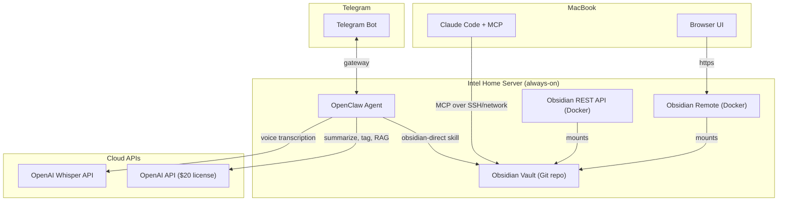
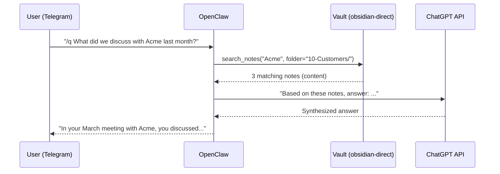

# Obsidian Second Brain with OpenClaw + Telegram + RAG

## Architecture Overview



## Components

### 1. Obsidian Vault (Intel Server)

**Location**: `~/obsidian-vault/` on the Intel server, initialized as a Git repo.

**Recommended Folder Structure** (hybrid type-based + customer-centric):

```
obsidian-vault/
  00-Inbox/            # All Telegram captures land here first
  10-Customers/        # Per-customer subfolder (e.g., 10-Customers/Acme Corp/)
  20-Resources/        # Articles, links, reference material
  30-Ideas/            # Quick thoughts, concepts, brainstorms
  40-Quotes/           # Saved quotes and snippets
  50-Files/            # Attachments (photos, PDFs, docs)
  90-Archive/          # Completed/outdated items
  Templates/           # Note templates (not synced to capture)
  .obsidian/           # Obsidian config (plugins, themes)
```

**Rationale**: Type-based top level gives fast visual scanning. Customers get their own folder because they're your primary axis. Inbox is the staging area -- OpenClaw drops everything there, and you (or a periodic OpenClaw task) triage into the right folder. Numbers enforce sort order.

**Templates** (Markdown with YAML frontmatter):
- `link.md` -- URL, title, summary, tags, source, date
- `customer.md` -- name, company, role, context, meeting notes, action items
- `idea.md` -- title, body, tags, related links
- `quote.md` -- text, author, source, tags
- `voice.md` -- transcription, summary, tags, original audio file ref

### 2. OpenClaw as Central Brain

OpenClaw is already running on the Intel server with a ChatGPT license. It will serve as:

- **Telegram gateway** (native `openclaw gateway` with Telegram channel)
- **Vault manager** (via `obsidian-direct` skill for read/write/search)
- **RAG engine** (reads relevant notes, sends to ChatGPT for synthesis)
- **Auto-processor** (fetches URLs, generates summaries, assigns tags)

**Setup steps**:
1. Install the `obsidian-direct` skill: `openclaw skill install obsidian-direct`
2. Configure the Telegram gateway with a BotFather token
3. Create a custom OpenClaw skill (`second-brain`) that handles:
   - Hybrid command parsing (`/link`, `/customer`, `/idea`, `/quote`, `/voice` commands + natural language fallback)
   - URL auto-processing: fetch page title/metadata via `curl`/`readability`, then call ChatGPT API for summary + tag extraction
   - Voice message handling: forward audio to OpenAI Whisper API, save transcription
   - Photo/file handling: save to `50-Files/`, create a reference note in `00-Inbox/`
   - RAG query mode: when user asks a question (no command prefix), search vault via `obsidian-direct`, assemble context, send to ChatGPT for answer synthesis

**Telegram Command Reference** (hybrid model):
| Command | Action |
|---|---|
| `/link <url> [comment]` | Save link with auto-summary and tags |
| `/customer <name> <note>` | Add note to customer file (creates if new) |
| `/idea <text>` | Save quick idea |
| `/quote <text> -- <author>` | Save quote with attribution |
| `/q <question>` | Query knowledge base (RAG) |
| `/search <term>` | Simple keyword search |
| (no command) | AI classifies and routes automatically |

### 3. Web UI Layer (Docker on Intel Server)

**Option A -- Obsidian Remote** (full Obsidian in browser):
```yaml
# docker-compose.yml
services:
  obsidian:
    image: ghcr.io/sytone/obsidian-remote:latest
    ports:
      - "8080:8080"
      - "8443:8443"
    volumes:
      - /home/user/obsidian-vault:/vaults/second-brain
      - obsidian-config:/config
    environment:
      - PUID=1000
      - PGID=1000
volumes:
  obsidian-config:
```
Access at `http://intel-server:8080` from any browser. Install Smart Connections plugin inside for in-browser semantic search and RAG chat.

**Option B -- Obsidian REST API** (for programmatic access):
```yaml
  obsidian-api:
    image: guillaumeredoules/obsidian-api
    ports:
      - "5000:8080"
    volumes:
      - /home/user/obsidian-vault:/vault
    environment:
      - SECRET_KEY=your-secret-key
      - USER=admin
      - PASSWORD=secure-password
```
Provides Swagger-documented REST endpoints for external integrations.

### 4. Claude Code MCP Integration (MacBook)

Add an Obsidian MCP server to Claude Code so you can query your vault directly from the IDE/terminal:

```bash
claude mcp add obsidian -- npx -y obsidian-mcp --vault /path/to/vault
```

For remote vault access (vault lives on Intel server), two options:
- **SSH mount**: Mount the vault via SSHFS on MacBook, point MCP at the mount
- **Network MCP**: Run the MCP server on the Intel server, connect Claude Code via SSE/network transport

Recommended: **SSHFS mount** for simplicity:
```bash
sshfs user@intel-server:/home/user/obsidian-vault ~/obsidian-vault-remote
claude mcp add obsidian -- npx -y obsidian-mcp --vault ~/obsidian-vault-remote
```

This gives you 12+ tools in Claude Code: `search_notes`, `read_note`, `create_note`, `get_backlinks`, `vault_stats`, etc.

### 5. Git Backup Strategy

**Auto-commit script** on the Intel server (cron every 30 min):
```bash
#!/bin/bash
cd ~/obsidian-vault
git add -A
git diff --cached --quiet || git commit -m "auto: vault snapshot $(date +%Y-%m-%d_%H:%M)"
```

**Remote backup**: Push to a private GitHub/Gitea repo (optional, for off-site backup).

**Large files**: Use `.gitignore` to exclude large attachments, or use Git LFS for photos/PDFs in `50-Files/`.

### 6. RAG Query Flow



For improved RAG quality over time, consider adding vector embeddings:
- Use OpenAI embeddings API to index all notes
- Store embeddings locally in SQLite or a JSON file
- On query, embed the question, find top-K similar notes, pass to ChatGPT
- This can be a v2 enhancement after the basic setup works

## Implementation Order

### Phase 1: Foundation (Day 1)
- Initialize the Obsidian vault with folder structure and templates on Intel server
- Initialize Git repo with `.gitignore`
- Set up cron-based auto-commit

### Phase 2: OpenClaw Integration (Day 1-2)
- Configure Telegram gateway in OpenClaw
- Install `obsidian-direct` skill
- Create custom `second-brain` skill with command routing
- Test basic capture: `/link`, `/idea`, `/customer`

### Phase 3: Auto-Processing (Day 2-3)
- Add URL fetching + ChatGPT summarization pipeline
- Add voice transcription via OpenAI Whisper API
- Add auto-tagging logic
- Add photo/file saving

### Phase 4: Query & RAG (Day 3-4)
- Implement `/q` command with vault search + ChatGPT synthesis
- Implement `/search` for keyword search
- Test natural language classification fallback

### Phase 5: Web UI + Claude Code (Day 4-5)
- Deploy Obsidian Remote Docker container
- Install Smart Connections plugin in the browser Obsidian
- Set up SSHFS mount on MacBook
- Configure Claude Code MCP server
- Deploy Obsidian REST API container (optional)

### Phase 6: Polish (Day 5+)
- Fine-tune natural language classification
- Add periodic "daily digest" summaries via Telegram
- Consider vector embeddings for better RAG (v2)
- Set up remote Git push for off-site backup
